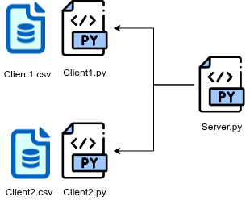

Real-world Federated Learning Tutorial
======================================

This tutorial shows how to use the ``MEDfl.rw`` (real-world) module to run a
**true multi-machine federated learning experiment**:

* One **central server** (orchestrator)
* Several **remote clients** (hospitals / institutions)
* Each client keeps its data **local** in a CSV file
* The server enforces a **shared schema** (same features/target on all sites)
* Validation / test splits are done **per client**, with optional overrides
* Optional **Differential Privacy (DP)** configuration per client

High-level architecture
-----------------------

In real-world mode, MEDfl is organized as follows:

* :mod:`MEDfl.rw.server`
  
  * ``FederatedServer``: wraps the Flower server and coordinates the training
  * ``Strategy``: defines the aggregation and training hyperparameters

* :mod:`MEDfl.rw.client`
  
  * ``FlowerClient``: local client that loads CSV data, applies splits, trains
  * ``DPConfig``: optional configuration for differential privacy

The typical workflow is:

1. Prepare a **CSV dataset** on each client machine.
2. Configure and start the **server** on a reachable host.
3. Configure and start the **clients**, pointing them to the server.
4. Monitor federated rounds and collect saved models and metrics.

1. Preparing client data
------------------------

Each client will load data from a **local CSV file**. All clients must share:

* The same **feature columns**
* The same **target column**
* An optional **ID column** (for split_mode based on IDs)

Example structure of a client CSV file:

.. code-block:: text

   id,MajorAxisLength,Area,Eccentricity,ConvexArea,label
   0,134.12,10023,0.88,10450,1
   1,120.57,8900,0.76,9100,0
   2,143.34,11010,0.91,11300,1
   ...

In this tutorial, on the client machine we will use:

.. code-block:: text

   ../data/client1_with_id.csv

with:

* ``id`` as the identifier
* ``MajorAxisLength, Area, Eccentricity, ConvexArea`` as features
* ``label`` as the target column

2. Server configuration
-----------------------

Create a file called :file:`run_server.py` on the **server machine**.

.. code-block:: python

   # run_server.py
   from MEDfl.rw.server import FederatedServer, Strategy

   # Optional: build a list of test IDs (here 0..1499)
   test_ids = list(range(1500))

   # Optional per-client overrides:
   # keys must match the hostname seen by MEDfl on each client machine.
   client_fractions = {
       "dinf-medomi-05b": {
           "val_fraction": 0.10,
           "test_ids": list(range(1500)),  # here: all IDs used for test
       }
   }

   custom_strategy = Strategy(
       name="FedAvg",
       fraction_fit=1.0,
       min_fit_clients=1,
       min_evaluate_clients=1,
       min_available_clients=1,

       local_epochs=10,
       threshold=0.5,
       learning_rate=0.01,
       optimizer_name="SGD",

       saveOnRounds=3,        # save the model every 3 rounds
       savingPath="./",       # where to store the checkpoints
       total_rounds=10,

       # --- Data schema enforcement ---
       features="MajorAxisLength,Area,Eccentricity,ConvexArea",  # comma-separated feature names
       target="label",                                           # target column name

       # --- Default split configuration (can be overridden per client) ---
       val_fraction=0.15,
       test_fraction=0.10,

       # --- Splitting strategy ---
       split_mode="per_client",  # split done independently on each client
       id_col="id",              # ID column used for test_ids-based splits

       # --- Optional per-client overrides ---
       client_fractions=client_fractions,
   )

   server = FederatedServer(
       host="0.0.0.0",   # listen on all interfaces
       port=8080,        # port to expose to clients
       num_rounds=10,
       strategy=custom_strategy,
   )

   if __name__ == "__main__":
       server.start()

Key parameters
~~~~~~~~~~~~~~

* ``features``: comma-separated list of feature names expected in each client CSV.
* ``target``: target column name for supervised learning.
* ``split_mode="per_client"``: each client performs its own train/val/test split.
* ``id_col``: column name containing sample IDs. Used when you want to define
  test sets using ``test_ids``.
* ``val_fraction`` and ``test_fraction``: default fractions of data used for
  validation and testing on each client.
* ``client_fractions``: per-client overrides, indexed by the **hostname** seen
  by MEDfl on that machine. You can override:

  * ``val_fraction``
  * ``test_fraction``
  * ``test_ids`` (list of IDs that must go to the test set)

* ``saveOnRounds`` and ``savingPath``: control how often and where the model
  checkpoints are saved.

3. Client configuration
-----------------------

On each **client machine** (e.g. each hospital), create a file
:file:`run_client.py` (or :file:`run_client_override_splits.py`) similar to:

.. code-block:: python

   # run_client_override_splits.py
   from MEDfl.rw.client import FlowerClient, DPConfig

   client = FlowerClient(
       server_address="100.65.215.27:8080",  # IP:port of the server
       data_path="../data/client1_with_id.csv",
       seed=42,
       dp_config=None,                      # or a DPConfig instance (see below)
   )

   if __name__ == "__main__":
       client.start()

Parameters:

* ``server_address``: must point to the **public / reachable address** of the
  server (as configured in ``FederatedServer``).
* ``data_path``: local path to the CSV file on this client machine.
* ``seed``: used for deterministic splits.
* ``dp_config``: optional differential privacy configuration (see next subsection).

4. Enabling Differential Privacy (optional)
-------------------------------------------

To enable differential privacy on a client, create a :class:`DPConfig` instance
and pass it to ``FlowerClient``:

.. code-block:: python

   from MEDfl.rw.client import FlowerClient, DPConfig

   dp_conf = DPConfig(
       noise_multiplier=1.0,
       max_grad_norm=1.0,
       batch_size=32,
       secure_rng=False,
   )

   client = FlowerClient(
       server_address="100.65.215.27:8080",
       data_path="../data/client1_with_id.csv",
       seed=42,
       dp_config=dp_conf,
   )

   if __name__ == "__main__":
       client.start()

Typical hyperparameters:

* ``noise_multiplier``: controls the magnitude of the added noise (higher =
  more privacy, more utility loss).
* ``max_grad_norm``: gradient clipping norm.
* ``batch_size``: local training batch size.
* ``secure_rng``: whether to use a cryptographically secure RNG.

5. Running the experiment
-------------------------

Once both sides are configured:

1. **On the server machine**:

   .. code-block:: bash

      python run_server.py

   The server will start and wait for clients to connect.

2. **On each client machine**:

   .. code-block:: bash

      python run_client_override_splits.py

   Each client will:

   * Load its local CSV data
   * Apply the default or overridden splits
   * Participate in federated training rounds coordinated by the server

3. During training:

   * The server runs for ``num_rounds`` (here 10).
   * Every ``saveOnRounds`` rounds (here 3), a checkpoint is written to
     ``savingPath`` on the server (`./` in the example).
   * Metrics (loss, accuracy, etc.) are logged via the strategy / server
     logic implemented in :mod:`MEDfl.rw`.

6. Customizing splits per client
--------------------------------

Sometimes you want **fine-grained control** over how each client splits its
data. MEDfl allows this through the ``client_fractions`` dictionary.

Example: a client with hostname ``dinf-medomi-05b`` should:

* Use **10%** of its data as validation,
* Use a specific set of IDs as test data.

.. code-block:: python

   client_fractions = {
       "dinf-medomi-05b": {
           "val_fraction": 0.10,
           "test_ids": list(range(1500)),  # IDs 0..1499
       }
   }

   custom_strategy = Strategy(
       # ...
       client_fractions=client_fractions,
   )

On that specific machine:

* The effective validation fraction will be 0.10 (instead of the default 0.15).
* Samples whose ``id`` is in ``test_ids`` will be forced into the test set.

.. note::

   Make sure that:

   * The hostname key (e.g. ``"dinf-medomi-05b"``) exactly matches the name
     seen by MEDfl on the client machine.
   * The ``id_col`` in the strategy configuration matches the ID column in the
     client CSV files.

7. Summary
----------

In this real-world tutorial, you have learned how to:

* Prepare local CSV datasets for each client
* Configure a **FederatedServer** with:

  * a specific aggregation strategy (``FedAvg``)
  * enforced feature/target schema
  * default and per-client validation/test splits
  * checkpoint saving

* Configure and run **FlowerClient** instances on remote machines
* Optionally enable **Differential Privacy** using ``DPConfig``

This setup corresponds to a **true multi-institution environment** where data
never leaves the client machines, and only model updates are exchanged.

